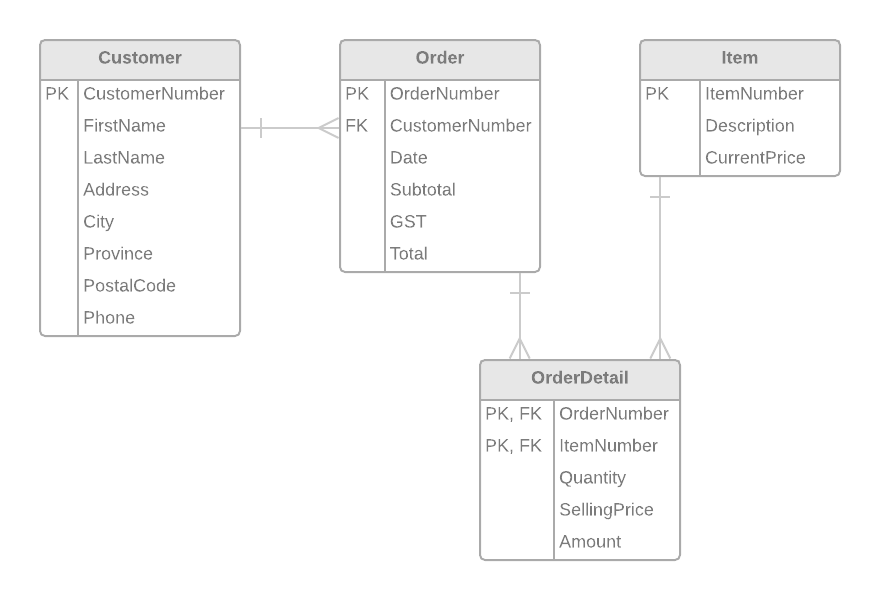

# Double-Checking Normalization Results

It's a good practice to double-check your normalization by attempting two verifications. The first is to do a **data verification**.

# Data Verification

> **Note:** This "verification" section would not be required on a lab. It's here for demonstration purposes only, as a step you would do on your own to see if the data "fits" your final set of normalized entitied.

The verification of the final set of entities after going through the normalization process can be demonstrated by drawing tables with the original document's data entered as a sample.

> **Order** Table

OrderNumber | CustomerNumber | Date | Subtotal | GST | Total
------------|----------------|------|----------|-----|-----
<b class="pk">219</b> | <u class="fk">137</u> | Jan 16, 2000 | 24.29 | 1.70 | 25.99

> **Customer** Table

CustomerNumber | FirstName | LastName | Address | City | Province | PostalCode | HomePhone
---------------|-----------|----------|---------|------|-----------|------------|---------
<b class="pk">137</b> | Fred | Smith | 123 SomeWhere St. | Edmonton | AB | T5H 2J9 | 436-7867

> **OrderDetail** Table

OrderNumber | ItemNumber | Quantity | SellingPrice | Amount
------------|------------|----------|--------------|------
<b class="pk"><u class="fk">219</u></b> | <b class="pk"><u class="fk">H23</u></b> | 1 | 11.99 | 11.99
<b class="pk"><u class="fk">219</u></b> | <b class="pk"><u class="fk">H319</u></b> | 2 | 4.99 | 9.98
<b class="pk"><u class="fk">219</u></b> | <b class="pk"><u class="fk">M24</u></b> | 8 | 0.29 | 2.32

> **Item** Table

ItemNumber | Description | CurrentPrice&dagger;
-----------|-------------|-------------
<b class="pk">H23</b> | Heater Fan Belt - 23" | 11.99
<b class="pk">H319</b> | Heater Fan Belt Support Brackets | 4.99
<b class="pk">M24</b> | Bolts - 24 mm | 0.29

**&dagger;** - *The current price for items can change over time.*

## ERD Description

> **Note:** This "ERD Description" section would not be required on a lab. It's here for demonstration purposes only, as a step you would do on your own to see if the structure/relationships *make sense* among your final set of normalized entitied.
 
- Each **Customer** *must be* <u>one who places</u> *one or more* **Order**s.
- Each **Order** *must be* <u>placed by</u> *one and only one* **Customer**.
- Each **Order** *must be* <u>made up of</u> *one or more* **OrderDetail**s.
- Each **OrderDetail** *must be* <u>for</u> *one and only one* **Order**.
- Each **Item** *may be* <u>sold under</u> *one or more* **OrderDetail**s.
- Each **OrderDetail** *must be* <u>a sale of</u> *one and only one* **Item**.

----

